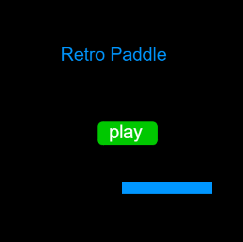
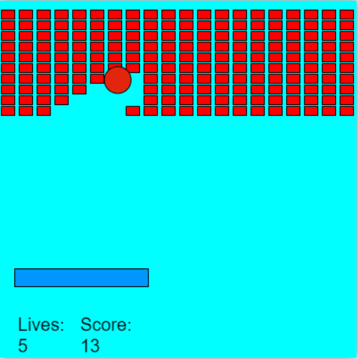

# retro-paddle-p5js
My first retro paddle game made using only p5.js and a p5.js editor.
Executing this program requires a p5.js editor with a preview canvas already preloaded.
  
### Home Page:

  
### The Game:

